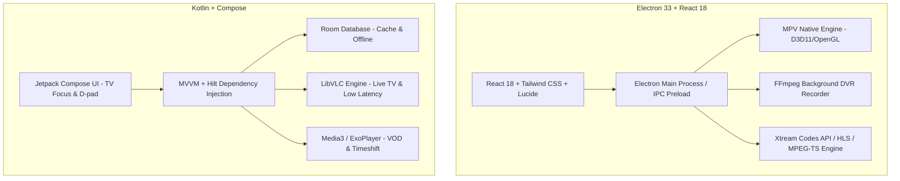

# 🚀 DYLANDOS IPTV ULTIMATE PRO

<div align="center">

[](package.json)
[](https://github.com/dylan42000/dylandos-iptv-ultimate-pro)
[](src/)
[](electron/)
[](android/)
[](android/)
[](LICENSE)

**A World-Class, High-Performance IPTV Client for Desktop (Windows), Android TV & Amazon Firestick.**

[Features](#-key-features) • [Architecture](#-system-architecture) • [Getting Started](#-getting-started) • [Android / Firestick Guide](#-android--firestick-setup) • [Build & Packaging](#-building-from-source) • [Keyboard & Remote Shortcuts](#-controls--shortcuts)

</div>

---

## 📖 Overview

**DYLANDOS IPTV ULTIMATE PRO** is an enterprise-grade, zero-buffering IPTV application built from the ground up to deliver a seamless streaming experience across all devices. Whether on high-end desktop workstations or Amazon Fire TV Stick streaming devices, the app combines hardware-accelerated video rendering, cable-style EPG navigation, multi-stream viewing, and robust DVR background recording capabilities.

---

## ✨ Key Features

### 📺 Playback & Video Engines
- **Hardware-Accelerated Playback**:
  - **Windows**: Native MPV engine integration via IPC (`node-mpv`) with D3D11 / OpenGL rendering pipelines and automatic FFmpeg stream fallback.
  - **Android & Fire TV**: Optimized dual-engine system using **LibVLC 3.6.0** for low-latency MPEG-TS Live TV and **Media3 / ExoPlayer 1.5.0** for VOD, Series, and USB timeshift.
- **Zero-Buffering Stream Optimization**: Intelligent adaptive buffer management and rapid connection failover.
- **Real-Time Stream Diagnostics**: Toggleable on-screen stats overlay displaying FPS, bitrate, dropped frames, cache depth, and active audio/video codecs.
- **Multi-View Mode**: Watch up to **4 live streams simultaneously** in an interactive split-screen grid.
- **Timeshift & Live Pause**: Pause, rewind, and fast-forward live broadcasts with buffer persistence.

### 📋 Content & Navigation
- **Xtream Codes API & M3U Support**: Full multi-category support for Live TV, Movies (VOD), and TV Series (Seasons & Episodes).
- **Cable-Style EPG Timeline Grid**: Interactive electronic program guide with vertical channel scrolling and horizontal time axis navigation.
- **Global Instant Search**: Search across Live TV channels, movies, and series with instant filtering.
- **Custom Lists & Folder Management**: Create custom categories, organize channels into custom lists, and reorder on the fly.
- **Multi-Profile Management**: Maintain isolated user profiles with independent favorites, watch history, and playlists.
- **Parental Controls & Category Locks**: Protect sensitive categories with PIN authentication.

### 🔴 DVR & Recording System
- **EPG-Integrated Recording**: Schedule one-time or recurring recordings straight from the program guide.
- **Smart Rule Recording**: Automated keyword-based and series-rule recording with conflict detection.
- **Background Recording Engine**: Continuous stream capture powered by an asynchronous FFmpeg worker pipeline.
- **DVR Library**: Built-in player and management dashboard to organize, playback, and export recordings.

---

## 🏗 System Architecture



---

## 💻 Tech Stack

| Domain | Platform | Technologies |
|---|---|---|
| **Desktop Frontend** | Windows | React 18, TypeScript, Tailwind CSS, Vite, Lucide Icons, React Window |
| **Desktop Backend** | Windows | Electron 33, Node MPV (IPC), FFmpeg, Electron Builder |
| **Android / TV** | Android / Fire TV | Kotlin 2.2.10, Jetpack Compose 1.7+, LibVLC 3.6.0, AndroidX Media3 1.5.0, Hilt, Room DB, Retrofit, OkHttp 5 |
| **Web Portal** | Web / Static | Vanilla JS, Modern CSS3 Grid/Flexbox, Static Deployment Portal |

---

## 📁 Repository Structure

```
dylandos-iptv-ultimate-pro/
├── android/                   # Native Android & Fire TV Project (Kotlin / Compose / LibVLC)
│   ├── app/                   # Application module, flavors (firestick, premium), layouts
│   ├── build.gradle.kts       # Android build configuration
│   └── README.md              # Android-specific documentation
├── electron/                  # Electron main process & native bridges
│   ├── main.cjs               # Electron lifecycle, window management, IPC handlers
│   ├── mpvManager.cjs         # IPC bridge controlling native mpv.exe engine
│   └── preload.cjs            # Secure context bridge between React & Electron
├── src/                       # React 18 Desktop Frontend
│   ├── components/            # Reusable UI (EpgGrid, MpvPlayer, VideoPlayer, MultiView, etc.)
│   ├── pages/                 # Full application pages (LiveTV, Guide, DVR, Movies, Series, etc.)
│   ├── hooks/                 # Custom React hooks (navigation, state, stream management)
│   └── services/              # API clients, profile storage, local database connectors
├── website/                   # Landing page, release portal, and deployment assets
├── scripts/                   # Build tools & vendor binary setup scripts
├── resources/                 # Icons, splash screens, and application assets
├── package.json               # Node.js dependencies and build scripts
└── vite.config.ts             # Vite bundler configuration
```

---

## 🚀 Getting Started

### Prerequisites
- **Node.js**: v18.0.0 or higher
- **npm**: v9.0.0 or higher
- **Java / JDK**: JDK 17+ (for Android builds)
- **Android SDK**: Build tools 34+ (for Android builds)

### 1. Clone the Repository
```bash
git clone https://github.com/dylandos-iptv-ultimate-pro.git
cd dylandos-iptv-ultimate-pro
```

### 2. Install Desktop Dependencies
```bash
npm install
```

### 3. Run in Development Mode
```bash
# Starts Vite dev server + Electron with native MPV bridge
npm run electron:dev
```

### 4. Build Desktop Installer / Portable Executable
```bash
# Clean build and package for Windows (NSIS installer + Portable EXE)
npm run electron:build:safe
```
Output binaries will be placed in the `release/` directory.

---

## 📱 Android & Firestick Setup

The Android project is pre-configured with two build flavors tailored for different hardware targets:

| Flavor | Architecture | Recommended Devices |
|---|---|---|
| `firestick` | `armeabi-v7a` | Amazon Fire TV Stick Lite / 4K / Max, 32-bit TV boxes |
| `premium` | `arm64-v8a` | Nvidia Shield TV, Modern Smart TVs, 64-bit Android devices |

### Building Android APKs
```bash
cd android

# Build optimized Fire TV Stick APK
./gradlew assembleFirestickRelease

# Build 64-bit Premium TV Box APK
./gradlew assemblePremiumRelease
```
APKs will be located under `android/app/build/outputs/apk/{firestick|premium}/release/`.

---

## ⌨️ Controls & Shortcuts

### Windows Desktop
| Shortcut | Action |
|---|---|
| `Space` | Toggle Play / Pause |
| `F` / `Double Click` | Toggle Fullscreen |
| `M` | Mute / Unmute Audio |
| `Up` / `Down` | Volume Up / Down |
| `Left` / `Right` | Seek Backward / Forward (10s) |
| `I` | Toggle Real-time Stream Diagnostics Overlay |
| `Esc` | Exit Fullscreen / Close Dialog |

### Android TV & Fire TV Remote
| Button | Action |
|---|---|
| `D-Pad Center` / `Select` | Show Controls / Select Channel |
| `D-Pad Up` / `Down` | Channel Navigation / Volume |
| `D-Pad Left` / `Right` | Scrub Playback / Timeline Navigation |
| `Menu` (Hamburger) | Open Channel Options / Add to Custom List / Category Lock |
| `Back` | Return to Previous Screen / Exit Player |

---

## 🔒 Security & Privacy

- **Encrypted Local Storage**: Credentials and stream tokens are securely stored locally on the device.
- **Parental PIN Protection**: Protected category mappings are secured with salt and hash checks.
- **Anonymized Telemetry**: Optional failure diagnostic logs exclude usernames, passwords, tokens, and stream server hostnames.

---

## 📄 License

This project is proprietary and confidential. All rights reserved by **Dylandos**.

